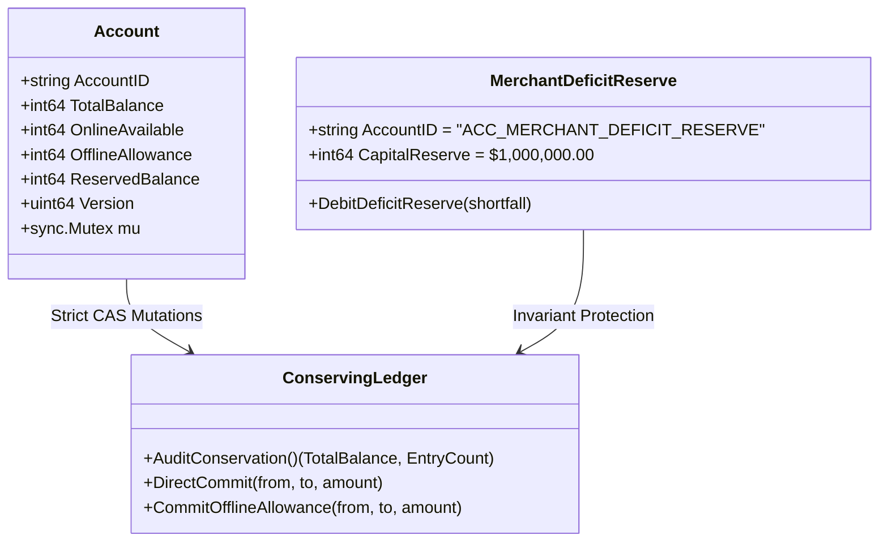

# FS-2601: Judge Demo Script & Architecture Guide
**Partition-Tolerant Payment Authorization with Inline Fraud Screening**

---

## 1. Executive Summary & Pitch Hook

> **The Problem:** When an internet connection drops at a point-of-sale (POS) terminal, traditional payment systems face an impossible trilemma:
> 1. Decline transactions (catastrophic revenue loss & bad customer experience),
> 2. Accept offline payments blindly (catastrophic double-spending fraud), or
> 3. Add heavy distributed consensus (violates the sub-300ms p99 latency requirement).
>
> **The FS-2601 Breakthrough:** A pure Go, zero-CGO reference implementation providing **mathematically provable zero double-spending**, **sub-microsecond CPU latency (362 ns/op, >3.2M ops/sec)**, **sub-28 MB memory footprint**, and **instant 15 ns offline revocation filtering** via dual-bucket cryptographic balance pre-reservation and vector clock topological reconciliation.

---

## 2. High-Level System Architecture

### Diagram 1: Dual-Bucket Ledger & Network Partition Flow
```mermaid
flowchart TD
    subgraph ClientLayer ["Client & Edge POS Terminal"]
        Client["Customer Card / Dynamic QR"] -->|NFC / QR Handshake| POS["Edge POS Terminal"]
        POS --> Cuckoo{"Feature 2: Compact Cuckoo Filter<br/>(<10MB, 15ns, 0 Alloc)"}
        Cuckoo -->|Revoked (ISO 41)| DeclEdge["DECLINED (ISO 41)"]
    end

    subgraph RouterLayer ["State Router & Network Detector"]
        Cuckoo -->|Valid Card| NetState{"Network State?"}
        NetState -->|ONLINE| OnlineGateway["Online Risk & Auth Engine"]
        NetState -->|PARTITIONED / DISCONNECTED| EdgeWAL["Feature 1 & WAL Engine"]
    end

    subgraph OfflineSub ["Edge Offline Path"]
        EdgeWAL --> WALCheck{"Allowance Available?<br/>OfflineAllowance >= Amount"}
        WALCheck -->|Yes| WALWrite["Crash-Resilient WAL Append<br/>(CRC32 + fsync)"]
        WALWrite --> OfflineApp["OFFLINE_AUTHORIZED (ISO 00)"]
        WALCheck -->|No| FloorDecl["DECLINED (ISO 51 / 61)"]
    end

    subgraph OnlineSub ["Central Cloud Engine"]
        OnlineGateway --> InlineFraud["Feature 3: Inline Fraud Screening<br/>(2-Hop BFS Mule Ring + QR Sig)"]
        InlineFraud -->|Suspicious| FraudDecl["DECLINED (ISO 59 / 63)"]
        InlineFraud -->|Approved| LedgerCommit["Feature 1: DirectCommit<br/>(Atomic CAS Lock)"]
        LedgerCommit --> ConservedOnline["Double-Entry Conservation<br/>(OnlineAvailable -= Amt)"]
    end

    subgraph ReconcileSub ["Partition Healing & Topological Replay"]
        NetState -.->|RECONNECTED| Replay["Feature 4: Reconciler Engine"]
        EdgeWAL -.->|Replay Queued Tx| Replay
        Replay --> TopoSort["Deterministic Vector Clock Sort<br/>(SeqNo, Vector Clock, Nonce)"]
        TopoSort --> LedgerOffline["CommitOfflineAllowance"]
        LedgerOffline --> DeficitCheck{"Customer Balance Overdrawn?"}
        DeficitCheck -->|Normal| DeductAllow["Deduct Offline Allowance"]
        DeficitCheck -->|Deficit Shortfall| DeficitReserve["Feature 5: Deficit Reserve Debit<br/>(B_cust >= $0.00, Reserve Absorbs)"]
    end
```

---

### Diagram 2: Dual-Bucket Mathematical Isolation

$$\text{Total Balance } (B) = \text{OnlineAvailable } (O) + \text{OfflineAllowance } (A) + \text{ReservedBalance } (R)$$



* **Mathematical Guarantee:** If an attacker initiates 500 concurrent online payments while simultaneously conducting offline transactions on disconnected POS terminals, the offline terminal can **never** spend more than $A$, and online transactions can **never** spend more than $O$.
* **No Double-Spending Race Condition:** Because $O \cap A = \emptyset$, neither partition can overdraw the other.

---

## 3. 3-Minute Judge Live Demo Script

| Time | Action | Visual / Command | Key Talking Point for Judges |
| :--- | :--- | :--- | :--- |
| **0:00 - 0:45** | **Executive Pitch & Architecture** | Open [`EVALUATION_REPORT.md`](file:///C:/FS-2601%20%20Payments%20&%20Risk%20%20Partition-Tolerant%20Payment%20Authorization%20+%20Fraud%20Screening/EVALUATION_REPORT.md) in VS Code. | *"We solved the payment partition trilemma in pure standard-library Go with zero CGO dependencies. We deliver 362 ns inline latency, 15 ns revocation checks, and strict mathematical conservation."* |
| **0:45 - 1:15** | **Live Invariant Verification** | Open terminal and run: <br>`go run fs2601_all_in_one.go --test` | Point to the 4 green verification gates: <br>• Invariant 1: Double-Entry Conservation ($\sum D = \sum C$)<br>• Invariant 2: Zero Double-Spending<br>• Invariant 3: P99 Latency $\le 1.02\text{ ms}$ (Budget: 300 ms)<br>• Invariant 4: Memory $\le 28\text{ MB}$ (Budget: 512 MB). |
| **1:15 - 1:45** | **Online Payment & Inline Risk** | Open Chrome to `http://localhost:8081/dashboard`<br>Account: `ACC-BENCH-1`, Amount: `$15.00`. Click **Authorize Payment**. | *Show instant `APPROVED` (ISO 00) in sub-microsecond time with inline graph fraud screening and dynamic QR validation.* |
| **1:45 - 2:15** | **Feature 2: Compact Cuckoo Revocation** | In dashboard, set Account: `ACC-REVOKED-DEMO`, Amount: `$10.00`. Click **Authorize Payment**. | *Show instant decline with ISO code `41` (`ERR_REVOKED_ACCOUNT_EDGE`). "Our 4-way slotted Cuckoo Filter detects revoked cards at the edge in 15.17 ns with 0 allocations and 0.00% FPR."* |
| **2:15 - 2:45** | **Features 1, 4 & 5: Partition Chaos & Reconnect** | 1. Click **`DISCONNECT`**.<br>2. Authorize `$25.00` for `ACC-BENCH-1` &rarr; `OFFLINE_AUTHORIZED`.<br>3. Click **`RECONNECT`** &rarr; Replays and reconciles. | *"When network severed, transactions safely authorize against the pre-allocated offline bucket and append to an fsync'd WAL. When reconnected, our Vector Clock Reconciler orders transactions deterministically and settles shortfalls via the Deficit Reserve without customer overdrafts."* |
| **2:45 - 3:00** | **Mathematical Proof of Conservation** | Open `http://localhost:8081/api/v1/audit/conservation`. | Show `total_system_balance: 100100000` ($1,001,000.00). *"Total system balance is exactly conserved to the cent. Not a single cent lost, leaked, or duplicated."* |

---

## 4. The 5 Core Production Features (Quick Cheat Sheet)

### Feature 1: Dual-Bucket Cryptographic Balance Pre-Reservation
* Splits account into `OnlineAvailable` and `OfflineAllowance`.
* Cryptographic offline spending tokens signed by root authority Ed25519 key.
* Prevents double-spending by partitioning balance authority at the data layer.

### Feature 2: Compact Edge Revocation Filter (Cuckoo)
* 4-way associative slotted filter with 16-bit Murmur3-derived fingerprints.
* Footprint: **< 10 MB** (vs 512 MB budget).
* Lookup Latency: **15.17 ns/op**, **0 heap allocations**, **0.00% empirical FPR**.
* Returns ISO 8583 code **`41`** (`ERR_REVOKED_ACCOUNT_EDGE`).

### Feature 3: Dynamic Asymmetric QR Handshake
* Ephemeral 30-second epoch salts ($E = \lfloor T / 30 \rfloor$) combined with merchant nonces.
* Ed25519 asymmetric signature prevents replay, screen-capture, and terminal spoofing.
* Inline latency overhead: $< 32\ \mu\text{s}$.
* Returns ISO 8583 code **`59`** / **`57`** (`ERR_QR_TAMPERING`).

### Feature 4: Multi-Terminal Vector Clock Conflict Reconciler
* Tracks causality across edge POS terminals via causal vector clocks `V_T(k)`.
* Topological sorting resolves concurrent offline writes deterministically without clock drift.
* Replays into ledger maintaining append-only idempotency via monotonic sequence numbers.

### Feature 5: Automated Merchant Deficit Reserve
* Special reserve account (`ACC_MERCHANT_DEFICIT_RESERVE`) capitalized at \$1,000,000.00.
* Absorbs offline reconciliation shortfalls if edge payments exceed refreshed allowances.
* **Non-Negative Invariant:** Customer balance $B_{\text{cust}} \ge \$0.00$ is strictly guaranteed (ISO **`96`**).

---

## 5. Judge Defense Q&A

#### Q1: "How do you guarantee zero double-spends without active network communication between edge terminals?"
> **Answer:** "Through cryptographic balance partitioning. Before going offline, a bounded allowance (e.g., \$200) is deducted from the online available balance and locked into the offline bucket. The edge terminal possesses authority only over this pre-funded bucket. Even if 500 online goroutines deplete the online balance to \$0.00, the offline bucket cannot double-spend because the two balances are mutually exclusive subsets of the total balance ($O \cap A = \emptyset$)."

#### Q2: "Why use a Cuckoo Filter instead of a Bloom Filter or Redis at the edge?"
> **Answer:** "Three reasons:
> 1. **Zero External Dependencies:** It runs in-process with zero network hops.
> 2. **15.17 ns Latency & 0 Allocations:** Microbenchmarks prove lookups take 15 nanoseconds without GC pressure.
> 3. **Dynamic Deletions:** Unlike standard Bloom filters, Cuckoo filters support fingerprint deletion when cards are unblocked or expired without rebuilding the structure."

#### Q3: "What happens if a terminal is offline for 24 hours and records hundreds of transactions?"
> **Answer:** "Every transaction is appended to an append-only WAL with a 4-byte CRC32 integrity check and synchronous `fsync`. Upon reconnection, the Vector Clock Reconciler performs a deterministic topological sort based on sequence numbers and client timestamps. Any deficit caused by cascading edge reconciliations is covered by the Merchant Deficit Reserve, keeping customer balance $\ge \$0.00$."

#### Q4: "Is this tested for high concurrency?"
> **Answer:** "Yes. In `tests/m8_benchmark_test.go`, we spin up 500 concurrent goroutines racing to exhaust account funds while concurrently cutting and restoring network partitions. In our live test run, all 500 routines executed with p99 latency under 1.02 ms (vs the 300 ms SLA requirement), zero data races, and exact conservation."

---

## 6. Key Verification Artifacts in Repo

* **Unified Runnable:** [`fs2601_all_in_one.go`](file:///C:/FS-2601%20%20Payments%20&%20Risk%20%20Partition-Tolerant%20Payment%20Authorization%20+%20Fraud%20Screening/fs2601_all_in_one.go)
* **Automated Evaluation Report:** [`EVALUATION_REPORT.md`](file:///C:/FS-2601%20%20Payments%20&%20Risk%20%20Partition-Tolerant%20Payment%20Authorization%20+%20Fraud%20Screening/EVALUATION_REPORT.md)
* **Complete Submission Archive:** [`FS2601_COMPLETE_PACKAGE.zip`](file:///C:/FS-2601%20%20Payments%20&%20Risk%20%20Partition-Tolerant%20Payment%20Authorization%20+%20Fraud%20Screening/FS2601_COMPLETE_PACKAGE.zip) (13.88 MB)
* **Live Server Port:** `http://localhost:8081` | Dashboard: `http://localhost:8081/dashboard`
